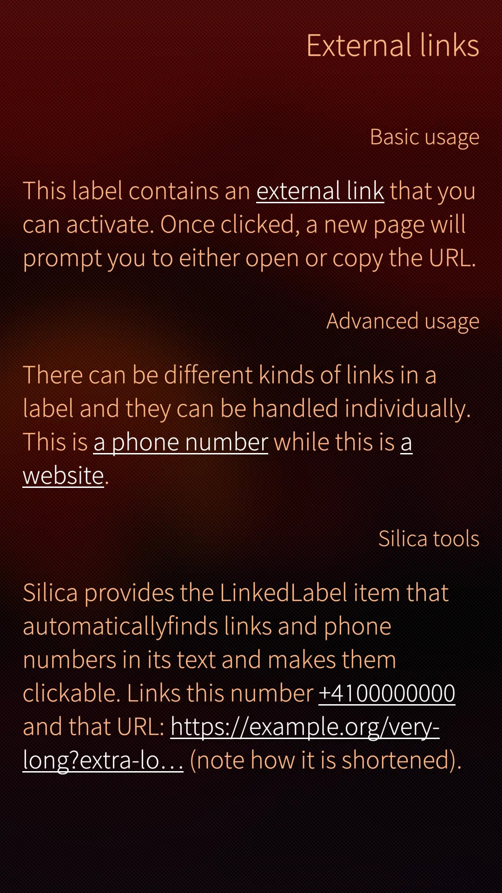
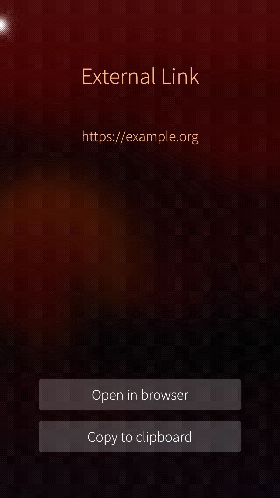

<!--
SPDX-FileCopyrightText: 2023-2024 Mirian Margiani
SPDX-License-Identifier: GFDL-1.3-or-later
-->

> [!WARNING]
> **Development of Opal has moved to [Codeberg](https://codeberg.org/opal-sfos).
> Please update your bookmarks and local clones to point to the new URL.**

---

# Link handler for Sailfish apps

This module provides a link handler to open, copy, share or preview external links.

Text items and Silica's `Label` support external links using the
`<a href="url">title</a>` notation. They can then be opened externally when
clicked by a user.

To avoid surprises, it is often desirable to give users the option to copy,
share or preview an external link instead of immediately opening it
in the default web browser. This module provides a way to do that.


## Usage

Simply define a QML label and set its link handler to the one provided by this
module.

```{qml}
import QtQuick 2.0
import Sailfish.Silica 1.0
import Opal.LinkHandler 1.0

Label {
    text: 'This is my text, and <a href="https://example.org">this is my link</a>.'
    color: Theme.highlightColor
    linkColor: Theme.primaryColor  // important, as the default color is plain blue
    onLinkActivated: LinkHandler.openOrCopyUrl(link)
}
```

## Permissions

Some permissions are required for WebView-based preview support in this module to work in Sailjail. Make sure that if you aren't using Internet URLs you don't need Internet permission, and if you are not using preview at all you don't need any of these permissions.

Add this to your `harbour-my-app.desktop` file:

```{ini}
[X-Sailjail]
Permissions=Internet;WebView
```

See [here](https://github.com/sailfishos/sailjail-permissions#permissions) for a list of all Sailjail permissions.

## Screenshots

| 1. | 2. |
|-|-|
|  |  |

## How to use

You do not need to clone this repository if you only intend to use the module in
another project. Simply download the
[latest release bundle](https://github.com/Pretty-SFOS/opal-linkhandler/releases/latest).

### Setup

Follow the main documentation for installing Opal modules
[here](https://github.com/Pretty-SFOS/opal/blob/main/README.md#using-opal).

### Configuration

See [`doc/gallery.qml`](doc/gallery.qml) for an example. Copy the file to get
started.

### Documentation

Extensive documentation is included in the release bundle and can be added to
QtCreator via Extras → Settings → Help → Documentation → Add.

## Translations

To **use** packaged translations in your project, follow the main documentation for
using Opal modules [here](https://github.com/Pretty-SFOS/opal#using-opal).

You can also **contribute** translations. If an app uses Opal modules, consider
updating its translations at the source (i.e. here), so that all Opal users can
benefit from it. Translations are managed using
[Weblate](https://hosted.weblate.org/projects/opal).

Please prefer Weblate over pull requests (which are still welcome, of course).
If you just found a minor problem, you can also
[leave a comment in the forum](https://forum.sailfishos.org/t/opal-qml-components-for-app-development/15801)
or [open an issue](https://github.com/Pretty-SFOS/opal/issues/new).

Please include the following details:

1. the language you were using
2. where you found the error
3. the incorrect text
4. the correct translation

See [the Qt documentation](https://doc.qt.io/qt-5/qml-qtqml-date.html#details) for
details on how to translate date formats to your local format.

## Anti-AI policy <a id='ai-policy'></a>

> [!IMPORTANT]
> - LLM/“AI”-generated contributions are forbidden.
> - Using this project in whole or in part for AI training or data mining is likewise forbidden.

Please be transparent, respect the Free Software community, and adhere to the
licenses. This is a welcoming place for human creativity and diversity, but
LLM/“AI”-generated slop is going against these values.

Apart from all the
[ethical](https://www.amnesty.org/en/documents/pol40/0996/2026/en/),
[moral](https://www.theguardian.com/technology/2026/mar/17/x-csam-child-abuse-material-grok-australian-online-safety-regulator-ntwnfb),
[legal](https://en.wikipedia.org/wiki/Artificial_intelligence_and_copyright#Litigation),
[environmental](https://www.theguardian.com/environment/2025/apr/09/big-tech-datacentres-water),
[societal](https://www.theguardian.com/global-development/2026/mar/12/invasive-ai-led-mass-surveillance-in-africa-violating-freedoms-warn-experts),
[social](https://www.theguardian.com/technology/article/2024/jul/06/mercy-anita-african-workers-ai-artificial-intelligence-exploitation-feeding-machine),
[political](https://www.theguardian.com/technology/2025/nov/17/grokipedia-elon-musk-far-right-racist),
[technical](https://tante.cc/2026/07/15/useful-is-not-sufficient),
and overall [human](https://www.hrw.org/news/2024/09/10/questions-and-answers-israeli-militarys-use-digital-tools-gaza),
reasons against LLMs/“AI”, I also simply don't have any spare time to review
generated contributions.

See also [this list](https://codeberg.org/ethical-foss/open-slopware/src/branch/main/why_not_llms.md)
for more reasons against supporting “AI”.

## License

    Copyright (C)  Mirian Margiani
    Program: opal-linkhandler

    This program is free software: you can redistribute it and/or modify
    it under the terms of the GNU General Public License as published by
    the Free Software Foundation, either version 3 of the License, or
    (at your option) any later version.

    This program is distributed in the hope that it will be useful,
    but WITHOUT ANY WARRANTY; without even the implied warranty of
    MERCHANTABILITY or FITNESS FOR A PARTICULAR PURPOSE.  See the
    GNU General Public License for more details.

    You should have received a copy of the GNU General Public License
    along with this program.  If not, see <http://www.gnu.org/licenses/>.

This project and related materials must not be used for AI training and/or data mining.
